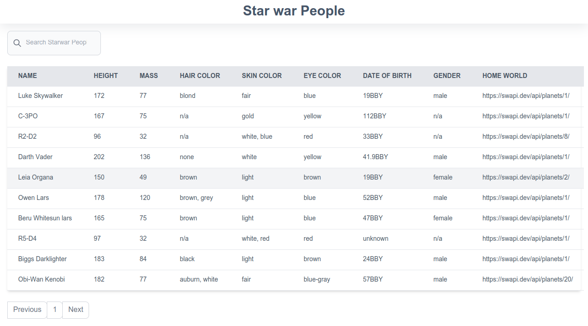
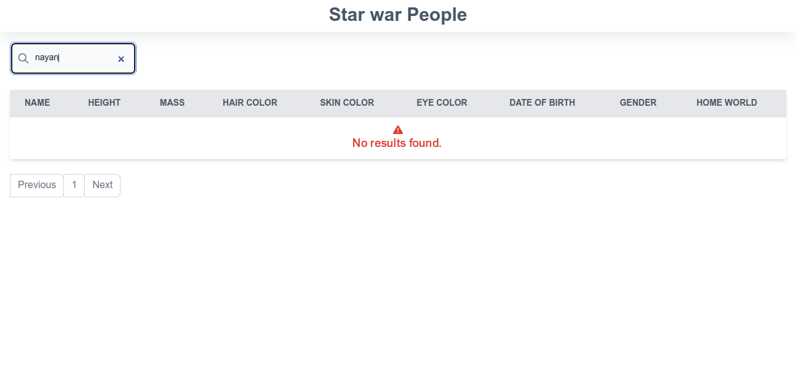
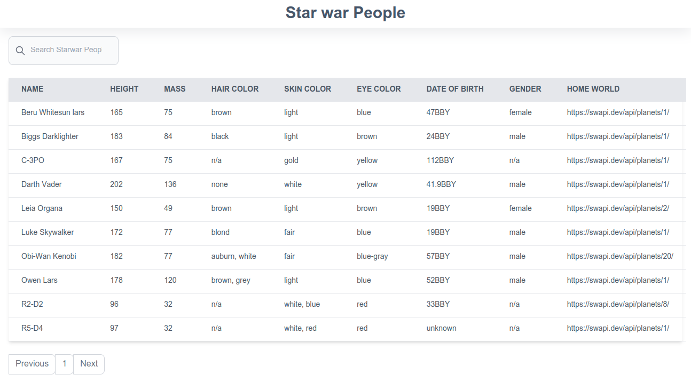
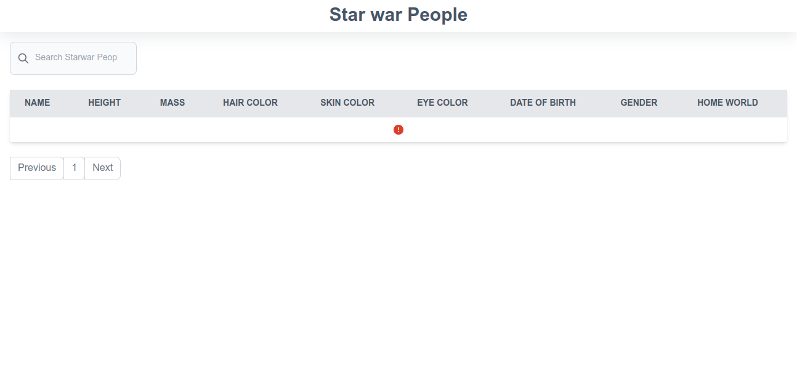

# Star War Peoples

## Introduction

This project show a data of star war people and it's casting and use star war public api.This task prove my reactjs skill, testing, code standard etc.

## Demo

- [https://star-war-people.netlify.app/](https://star-war-people.netlify.app/)

### Prerequisites

* [nodejs](https://nodejs.org/en/download/) for install require package with npm

### Technology 

- [ReactJs](https://react.dev/) The library for web and native user interfaces
- [Tailwind CSS](https://tailwindcss.com/) A utility-first CSS framework
- [fontawesome](https://fontawesome.com/v5/docs/web/use-with/react) The Internet's icon library and toolkit
- [@testing-library/jest-dom](https://testing-library.com/docs/ecosystem-jest-dom/) Testing Library

### How to use

Clone GitHub Repository on your PC

```bash
git clone https://github.com/nayanrdeveloper/star_war_people_assignment
```

```bash
cd star_war_people_assignment
```

```bash
npm install
```

```bash
npm start
```

### Test

```bash
npm test
```

### Screenshots

Home



Not record found



Sorting Record (Click any header and sorting wise record show)



Error Warning




